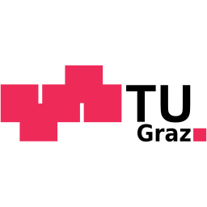

    

        
Next community meeting

        

            <time datetime="2025-11-25T14:30:00+0100">November 25, 14:30</time>
            <a href="community-meeting.ics" class="md-button sm">Calendar link</a>
        

    

    

        
Latest blog post

        

            <a href="/blog/2025/07/15/an-early-look-at-the-common-dmp-api/">An early look at the common DMP API</a>
        

    

    

        
Latest release

        

            <a href="https://github.com/damap-org/damap-backend/releases/latest" target="_blank" rel="noopener noreferrer">DAMAP v4.6.1</a>
        

    

# About DAMAP

DAMAP supports researchers in managing both data and code along the research data lifecycle and helps meet funders' requirements by generating DMPs in funder-specific templates. DAMAP can integrate with an institution's existing databases, e.g., project, HR, to pull relevant data into a DMP, increasing accuracy and reducing the overall effort needed to complete a DMP.

The content and structure of DAMAP is based on Science Europe's Core Requirements for Data Management Plans. The tool guides users through all sections of a DMP in ten steps by asking questions, suggesting text, and providing helpful information. As a result, DAMAP delivers a DMP as a document that can be customized and used for submission to European and national research funders. Furthermore, the tool is compatible with the RDA's recommendation for machine-actionable DMPs and offers a JSON export of the DMP.

# Why DAMAP?

-   :material-book-open-variant:{ .lg .middle } __Guidance__

    ---

    DAMAP guides you step by step through the different sections of a DMP following the [Practical Guide to the International Alignment of Research Data Management](https://doi.org/10.5281/zenodo.4915861){target="_blank"}.

-   :material-export:{ .lg .middle } __Export__

    ---

    DAMAP exports a pre-filled DMP as a Word document that you can customize and use for submission to funders. 
    Supported templates:
    <ul><li>FWF</li>
    <li>Horizon Europe</li>
    <li>Science Europe</li></ul>

-   :material-cog-refresh:{ .lg .middle } __Automation__

    ---

    DAMAP saves you work by:
    <ul>
    <li>pre-filling content with detailed information from your CRIS application and other systems</li>
    <li>providing wizards, guidance, and item lists to choose from</li>
    <li>suggesting answers that you can either comply with or adjust to your needs</li>
    </ul>

-   :material-human-greeting-proximity:{ .lg .middle } __Compatibility__

    ---

    DAMAP is compatible with the [RDA recommendation on machine actionable DMPs](https://doi.org/10.15497/rda00039){target="_blank"}.

# Community

    <h2>Next community meeting</h2>
    <time datetime="2025-11-25T14:30:00+0100">
        Tue
        Nov 25
        14:30
    </time>
    <footer>
        <a href="community-meeting.ics" class="md-button md-button--full">Calendar link</a>
    </footer>

The DAMAP community is a collaboration between several universities in different stages of deploying DAMAP to create DMPs as well as for student education in research data management techniques.

We work together on a wide range of topics from DMPs to general data management questions to technical integration of various DMP management and analysis tools. Join us <strong>on the last Tuesday of every month</strong> for a lively discussion on any of these topics. No matter if you are a seasoned data steward or an enthusiast just starting out, everyone is welcome here.

These institutions have already deployed DAMAP and have integrated it into their data management planning. Several more universities are in the process of deploying it and are planning to use it in the future.

-   __TU Wien DMP Tool__

    ---

    {target="_blank"}

    [Access :material-arrow-right-circle:{ .middle }](https://dmptool.tuwien.ac.at/){ .md-button .md-button--full target="_blank" }
 
-   __TU Graz DMP Tool__
    
    ---
    
    

    [Access :material-arrow-right-circle:{ .middle }](https://dmp.tugraz.at/){ .md-button .md-button--full target="_blank" }

-   __Med Uni Graz DMP Tool__

    ---

    

    [Access :material-arrow-right-circle:{ .middle }](https://www.medunigraz.at/){ .md-button .md-button--full target="_blank" }

# Try it out

[:material-access-point-check:{ .superlarge .middle }](https://damap.it.tuwien.ac.at/){target="_blank"}

Click [here](https://damap.it.tuwien.ac.at/){target="_blank"} to try the DAMAP demo instance. Please contact us at [&#105;&#110;&#102;&#111;&#64;&#100;&#97;&#109;&#97;&#112;&#46;&#111;&#114;&#103;](&#109;&#97;&#105;&#108;&#116;&#111;&#58;&#105;&#110;&#102;&#111;&#64;&#100;&#97;&#109;&#97;&#112;&#46;&#111;&#114;&#103;) for access.

***Note:** additional services have been integrated with the application to simulate how the tool will operate in production.*

:material-lightbulb-on-10: Tip: use our [tutorial](https://zenodo.org/records/14000899/preview/DAMAP_tutorial_202410.pdf?include_deleted=0){target="_blank"} to help you navigate DAMAP and create a DMP.
 

# Get our code

DAMAP is open source and available under the <a href="https://opensource.org/license/mit" target="_blank">MIT license</a>.

-   [:material-github:{ .superlarge .middle } Frontend](https://github.com/damap-org/damap-frontend){target="_blank"}
 
-   [:material-github:{ .superlarge .middle } Backend](https://github.com/damap-org/damap-backend){target="_blank"}

# Contact

Are you interested in DAMAP? Reach out to us at [&#105;&#110;&#102;&#111;&#64;&#100;&#97;&#109;&#97;&#112;&#46;&#111;&#114;&#103;](&#109;&#97;&#105;&#108;&#116;&#111;&#58;&#105;&#110;&#102;&#111;&#64;&#100;&#97;&#109;&#97;&#112;&#46;&#111;&#114;&#103;) for general questions or for help with deploying DAMAP at your institution.